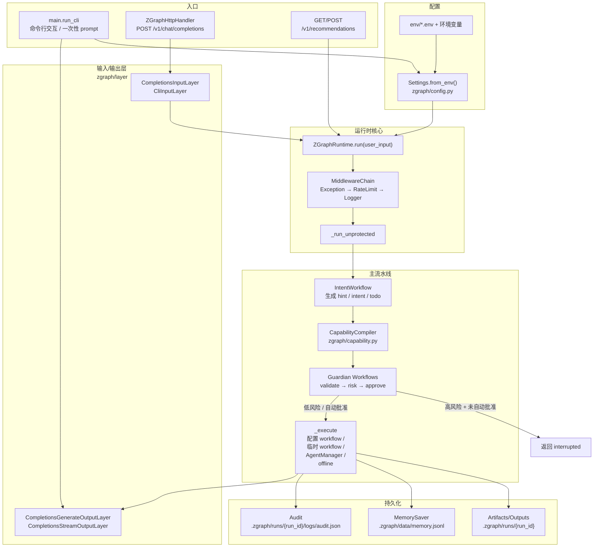
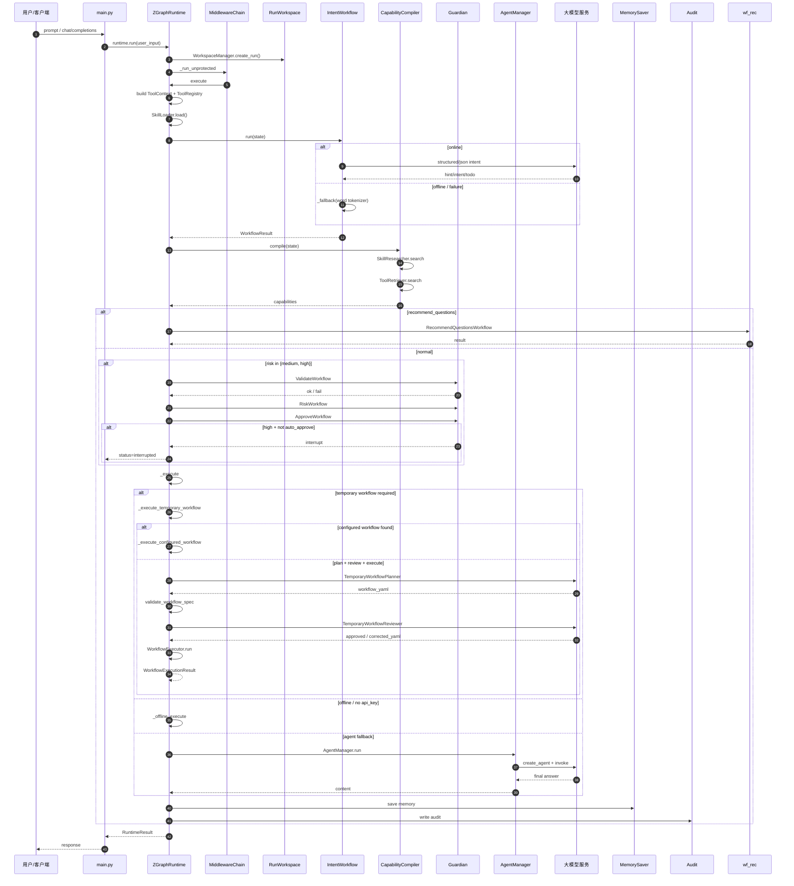
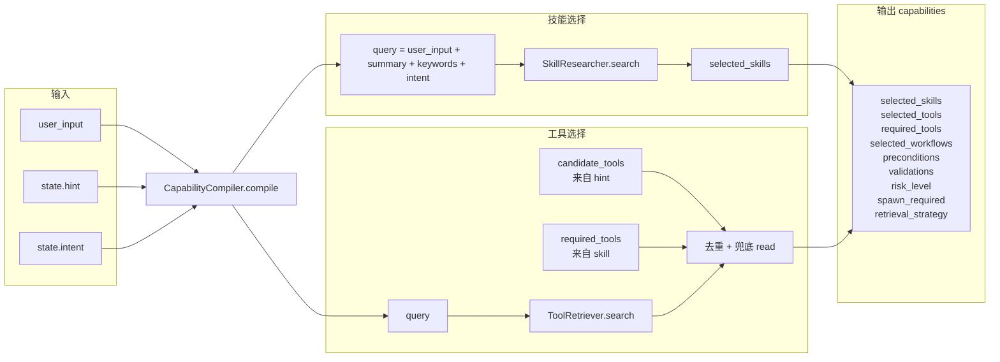
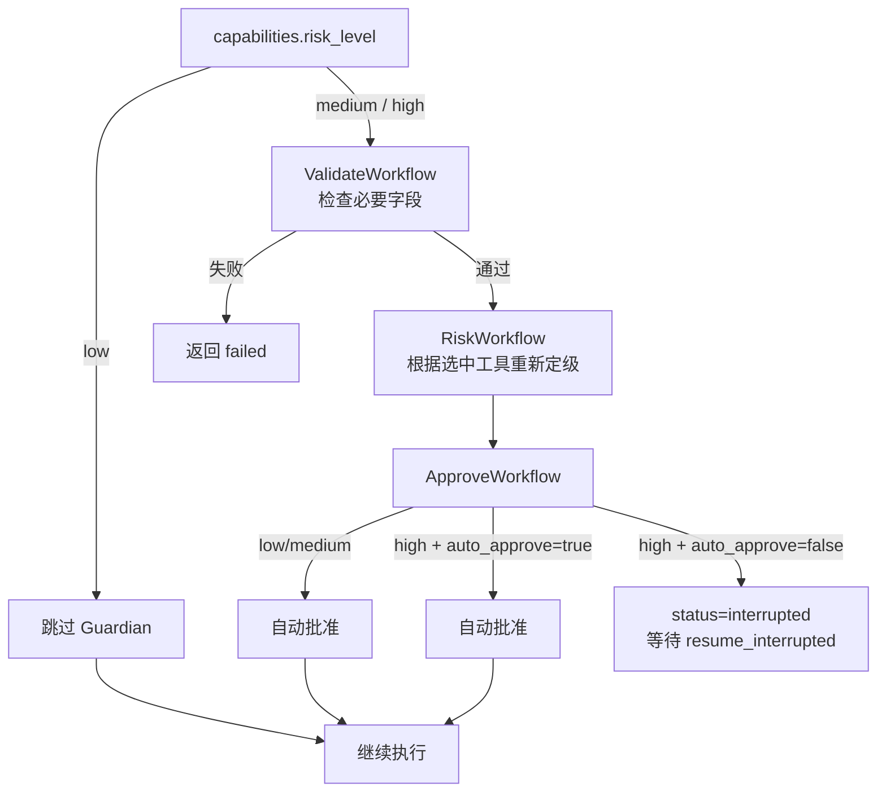
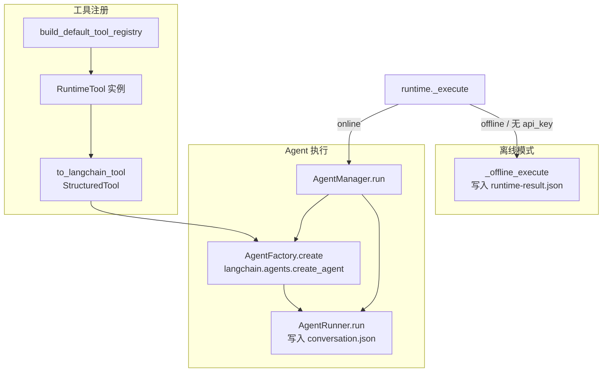
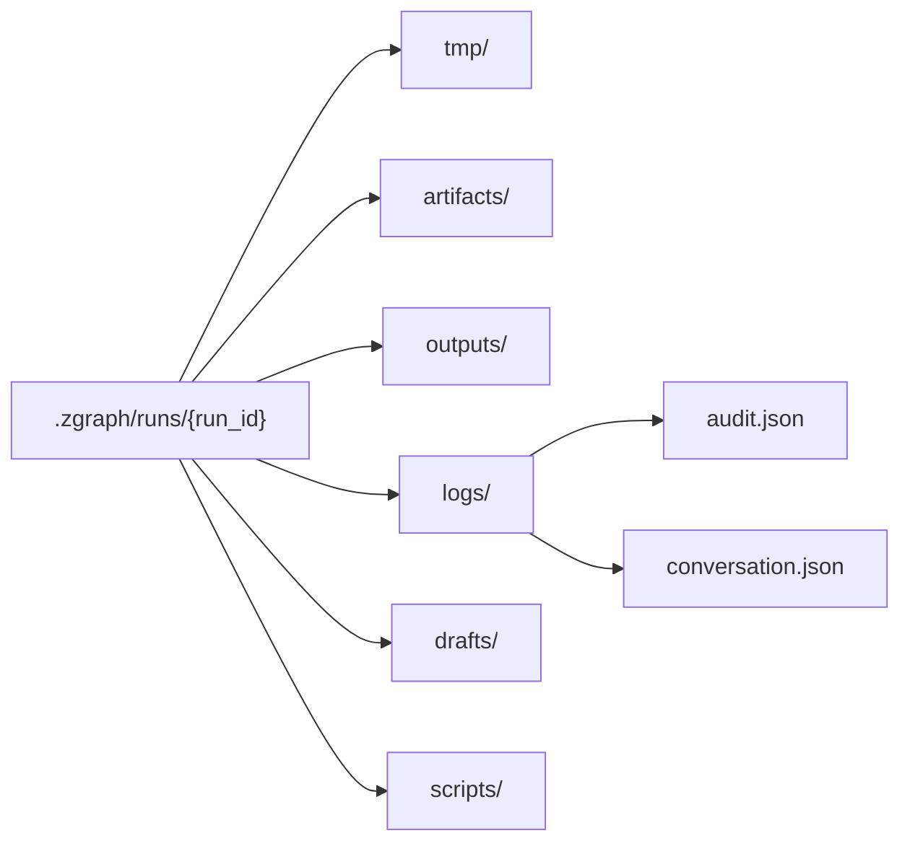
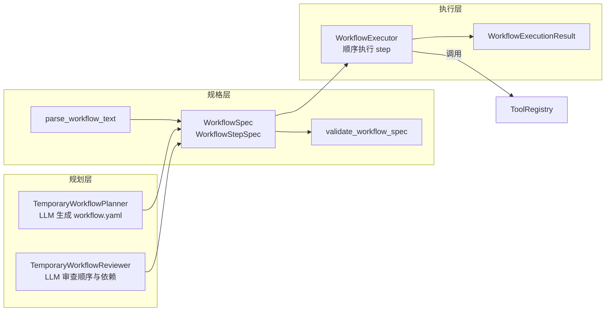

# ZGraph 架构图

本文档用 Mermaid 流程图描述 ZGraph 的整体架构与运行时数据流。

> 生成时间：2026-06-13
> 基于 `zgraph/` 下全部源码绘制。

## 1. 总体运行时流程

## 2. 组件依赖全景

```mermaid
flowchart TB
    subgraph Entry["入口"]
        main["main.py"]
    end

    subgraph ConfigModule["配置"]
        cfg["zgraph/config.py<br/>Settings"]
    end

    subgraph LayerModule["层适配器<br/>zgraph/layer"]
        layer_in["input.py<br/>Cli/Completions"]
        layer_out["output.py<br/>Generate/Stream"]
        layer_evt["event.py"]
    end

    subgraph RuntimeModule["运行时"]
        runtime["zgraph/runtime.py<br/>ZGraphRuntime"]
        result["RuntimeResult"]
    end

    subgraph MiddlewareModule["中间件<br/>zgraph/middleware"]
        mw_chain["MiddlewareChain"]
        mw_exc["ExceptionMiddleware"]
        mw_rate["RateLimitMiddleware"]
        mw_log["LoggerMiddleware"]
    end

    subgraph WorkspaceModule["工作区<br/>zgraph/workspace.py"]
        wm["WorkspaceManager"]
        rw["RunWorkspace<br/>tmp/artifacts/outputs/logs"]
    end

    subgraph CapabilityModule["能力编译<br/>zgraph/capability.py"]
        cc["CapabilityCompiler"]
    end

    subgraph TokenizerModule["分词/检索<br/>zgraph/core/tokenizer"]
        tok_svc["build_tokenizer"]
        tok_word["WordTokenizer"]
        tok_rerank["RerankTokenizer"]
    end

    subgraph SkillsModule["技能<br/>zgraph/core/skills"]
        sk_load["SkillLoader"]
        sk_res["SkillResearcher"]
        sk_files[".zgraph/skills/**/*.SKILL.md"]
    end

    subgraph ToolsModule["工具<br/>zgraph/core/tool"]
        tb["build_default_tool_registry"]
        reg["Registry[RuntimeTool]"]
        t_ret["ToolRetriever"]
        t_impl["Read/Write/Update/Delete<br/>Glob/Bash/DateTime<br/>Todo/Interrupt/Spawn"]
    end

    subgraph WorkflowsModule["工作流<br/>zgraph/workflow"]
        wf_base["base.py<br/>Workflow Protocol"]
        wf_intent["service/intent.py"]
        wf_rec["service/recommend.py"]
        wf_val["guardian/validate.py"]
        wf_risk["guardian/risk.py"]
        wf_app["guardian/approve.py"]
        wf_spec["spec.py<br/>WorkflowSpec / validate"]
        wf_plan["planner.py<br/>TemporaryWorkflowPlanner<br/>TemporaryWorkflowReviewer"]
        wf_exec["executor.py<br/>WorkflowExecutor"]
    end

    subgraph ProviderModule["模型提供方"]
        provider["zgraph/core/provider.py<br/>build_chat_model"]
    end

    subgraph AgentModule["Agent<br/>zgraph/core/agent"]
        am["AgentManager"]
        af["AgentFactory"]
        ar["AgentRunner"]
        ah["AgentHandle"]
        ct["CancellationToken"]
    end

    subgraph MemoryModule["记忆<br/>zgraph/core/memory"]
        ml["MemoryLoader"]
        mc["MemoryCompressor"]
        jms["JsonlMemorySaver"]
        mem_file["memory.jsonl"]
    end

    main --> cfg
    main --> runtime
    main --> layer_in
    main --> layer_out
    runtime --> cfg
    runtime --> wm --> rw
    runtime --> mw_chain
    mw_chain --> mw_exc
    mw_chain --> mw_rate
    mw_chain --> mw_log
    runtime --> sk_load
    sk_load --> sk_files
    runtime --> tb
    tb --> reg
    reg --> t_impl
    t_impl --> rw
    runtime --> wf_intent
    wf_intent --> provider
    runtime --> cc
    cc --> tok_svc
    tok_svc --> tok_word
    tok_svc --> tok_rerank
    cc --> sk_res
    cc --> t_ret
    sk_res --> tok_svc
    t_ret --> tok_svc
    runtime --> wf_val
    runtime --> wf_risk
    runtime --> wf_app
    wf_risk --> t_impl
    runtime --> am
    am --> af
    am --> ar
    am --> ah
    ar --> ct
    af --> provider
    runtime --> ml
    runtime --> mc
    runtime --> jms
    ml --> mem_file
    jms --> mem_file
    runtime --> result
    result --> layer_out
    wf_rec --> ml
    wf_rec --> provider
```

## 3. 主运行时序列图

## 4. 能力编译（Capability Compiler）细节

## 5. Guardian 风险审批链

## 6. 工具执行与 Agent 调用

## 7. 工作区目录结构

## 8. Workflow 引擎（已接入主 runtime）

项目里实现并接入了一套完整的 Workflow 规划/审查/执行能力，作为 `AgentManager` 之外的确定性执行路径。

> 说明：
> - `WorkflowExecutor` 支持变量传递（`outputs`）、`needs` 依赖、`assert` 断言、`retries` 重试。
> - `TemporaryWorkflowPlanner/Reviewer` 利用 LLM 生成并审查 workflow。
> - `WorkflowRegistry` 根据 skill 的 `workflow:` / `workflow_mode: strict` / `strict-workflow` validation / `workflow` tag 查找对应的 `workflow.yaml`。
> - `WorkflowSlotResolver` 从用户输入、`state.hint.slots` 和 LLM 提取 workflow 输入槽位。
> - 在 `_execute` 中，如果 `capabilities.selected_workflows` 包含 `temporary_workflow`，则优先走 workflow 路径：先尝试 `configured workflow`，找不到则 `plan → review → execute`；否则才回退到 `AgentManager`。

## 9. 关键结论

1. **主数据流**：`入口 → Settings → ZGraphRuntime → Middleware → Intent → Capability → Guardian → Execute → Memory/Audit → Output`。
2. **执行路径二选一**：在线时调用 `AgentManager`（LLM 自主选工具）；离线时只生成静态结果。
3. **高风险控制**：`bash` / `delete` 会触发 `high` 风险；默认需要显式批准，`--auto-approve` 可自动过。
4. **有两套 I/O 层**：`zgraph/layer` 正在使用；`zgraph/core/adapter` 已定义但当前未接入。
5. **Workflow 引擎已启用**：`planner.py` / `executor.py` / `spec.py` / `registry.py` / `slots.py` 已接入 `runtime.py`。当能力编译器标记 `temporary_workflow` 或 skill 声明了配置 workflow 时，runtime 会优先进行确定性 workflow 执行，而不是让 LLM agent 自主选工具。
